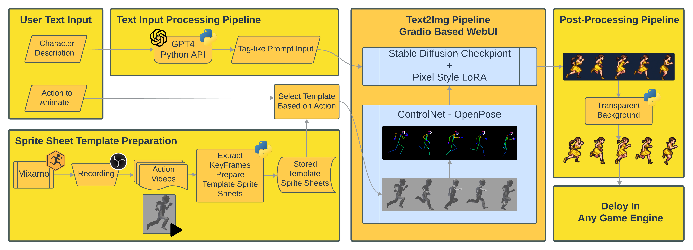
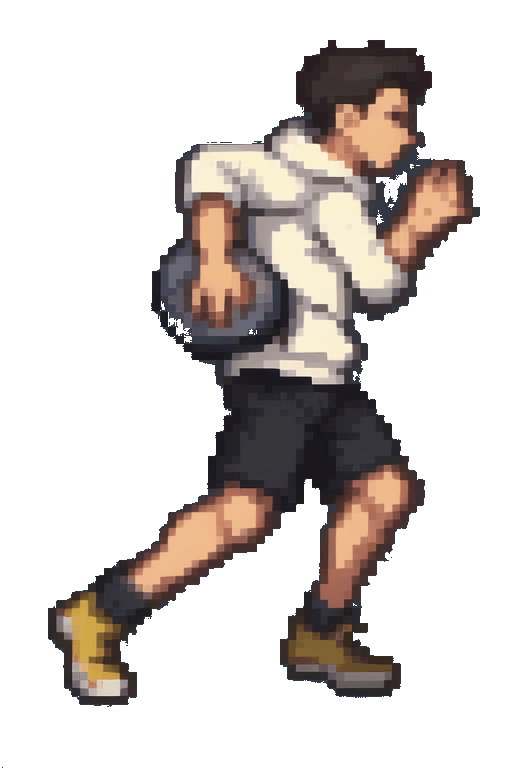
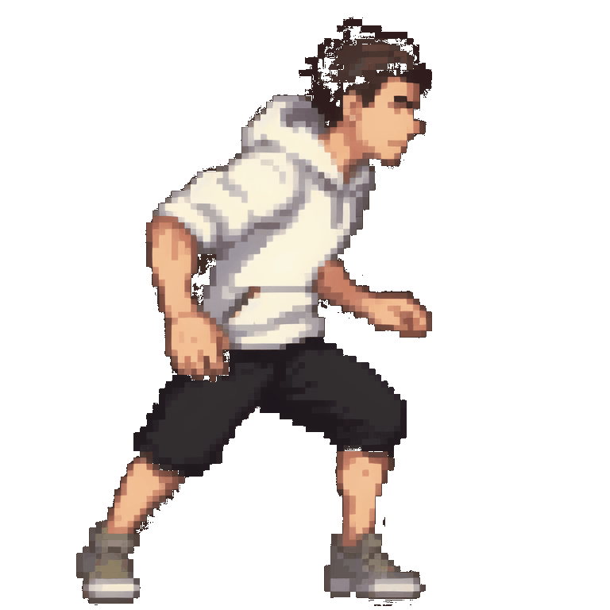
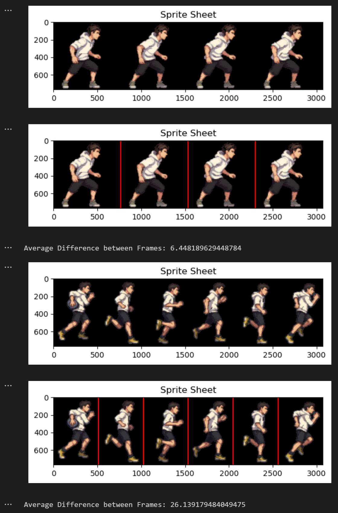
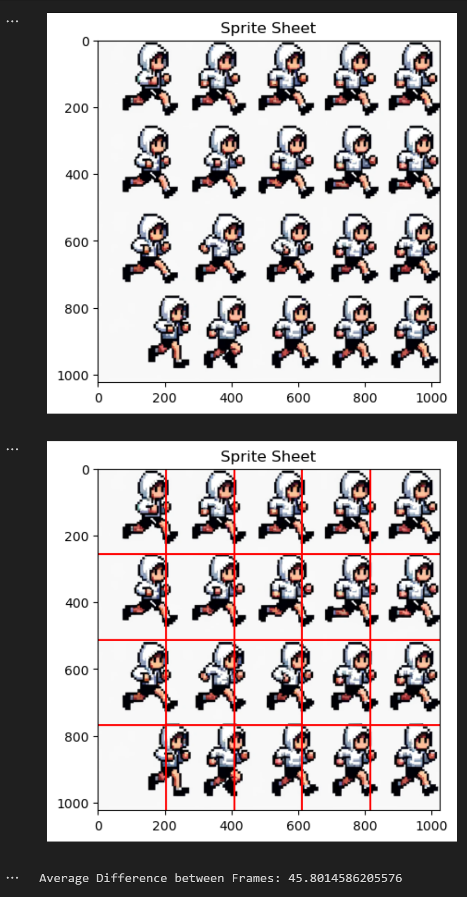

# Animyth: A tool for assisting creation of animation for game development

## Overview
Animyth is an innovative approach to sprite sheet generation, leveraging advanced AI models to streamline the process of creating detailed, action-specific sprite sheets for game development. This project combines the power of GPT-4 for text processing and a stable diffusion model with ControlNet extension for sprite generation, offering a unique solution for game designers and animators.

## Features
- **Text-to-Sprite Sheet Conversion**: Transform simple text descriptions into detailed sprite sheets.
- **Custom Animation Templates**: Use custom dummy models in Mixamo for tailored animations.
- **Python Scripting**: Automated image processing for efficient sprite sheet creation.
- **Game Engine Compatibility**: Sprite sheets ready for integration into popular game engines like Unity.

## Getting Started
### Prerequisites
Before you begin, ensure you have met the following requirements:

- [ControlNet v1.1 nightly](https://github.com/lllyasviel/ControlNet-v1-1-nightly): For advanced model control and sprite sheet generation.
- [ControlNet v1.1 on Hugging Face](https://huggingface.co/lllyasviel/ControlNet-v1-1/tree/main): Access to the ControlNet model through Hugging Face's interface.
- [Pixel LoRA](https://civitai.com/images/3615104): LoRA for pixelizing the image
- [AAM Anylora Anime Mix Model](https://civitai.com/models/84586/aam-anylora-anime-mix-anime-screencap-style-model): A specific model used for anime-style sprite generation.
- [Stable Diffusion Web UI](https://github.com/AUTOMATIC1111/stable-diffusion-webui/tree/dev): Web interface for stable diffusion models.

Make sure to install and set up these resources as they are integral to the functioning of the Animyth project.

### Installation
Provide step-by-step instructions on how to get a development environment running.

## How Animyth Works
Explain how to use Animyth, including how to input descriptions and generate sprite sheets.

The input to Animyth will be a text description of a character following a specific format:
```
                    {A pixel-styled sprite sheet of a $Type $Description, $Action}
```

An example input would be 
```
A pixel-styled sprite sheet of a boy wearing white hoodie and black shorts, run
```

The input is processed by GPT4 API into a tag-like output
```
pixel,pixel art,pixelart,xiangsu,xiang su, full body,(((solid background))),1boy, side view, masterpiece,best,quality, white hoodie, black shorts, run
```

Then, this tag-like input will be passed into stable diffusion webui for sprite sheet generation.

Meanwhile, the webui enables the ControlNet extension for character pose estimation from the selected prepared sprite sheet template for the corresponding action.

After a while, depending on the hardware on your machine, the sprite sheet will be generated mapping the text description as well as the pose estimated.

### Prompt to GPT4
```
This is my input example
 'A pixel-styled sprite sheet of a boy wearing white hoodie and black shorts, run' 

 output should look like 
'pixel,pixel art,pixelart,xiangsu,xiang su, full body,(((solid background))),1boy, side view, masterpiece,best,quality, white hoodie, black shorts, run'

You may add your own tags to enhance the appearance of the character like the colour of hair or clothes.

Always include “pixel, pixel art, pixelart, xiangsu, xiang su, 8bit, 16bit, full body, (((solid background))), side view, masterpiece, best quality” in the output.

If it is a girl or a boy, you should say 1girl or 1boy
```


## Workflow Overview
1. **Text Processing**: Input text is converted to tag-like descriptions using GPT-4.
2. **Animation Preparation**: A custom dummy model is uploaded to Mixamo for animation creation.
3. **Sprite Sheet Generation**: The animations are processed into sprite sheets with the stable diffusion model.
4. **Post-Processing**: Additional Python scripts are used to refine the sprite sheets, like making backgrounds transparent.



## Example Outputs
Describe the type of outputs Animyth can generate, and provide examples.




## Evaluation
Discuss both qualitative and quantitative evaluation methods used to assess the generated sprite sheets.

Example:




## Future Work
Outline potential improvements and future directions for Animyth.

- Make the pipeline more automatable
- Improve quantitative analysis method
- Have more variation of the actions


## Contributing
Instructions for contributing to the project.

## Authors
- **Sherry** - Input Dataset Creation and Prompt Engineering
- **Sky** - Sprite Sheet Template Preparation and Generation

## License
Include license information here.

## Acknowledgments
Mention any individuals, organizations, or resources that were instrumental in the development of Animyth.

[//]: # (Insert any additional images, charts, or relevant links here)

---
