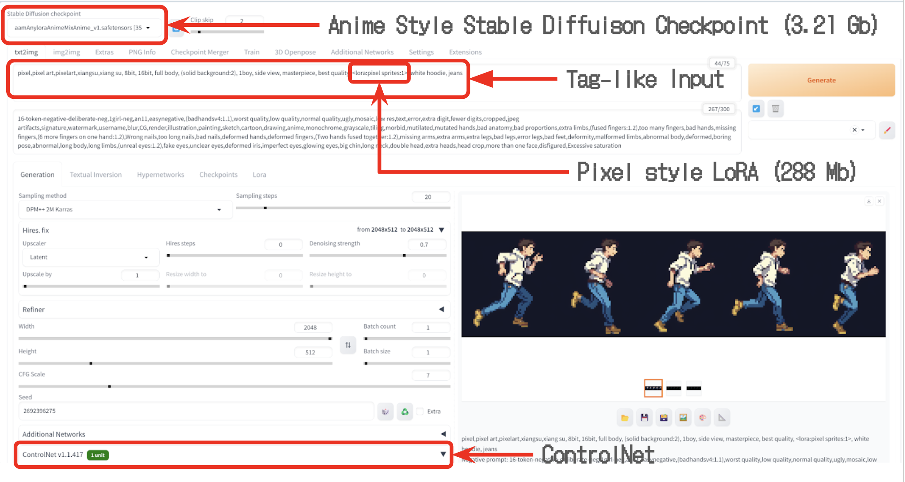
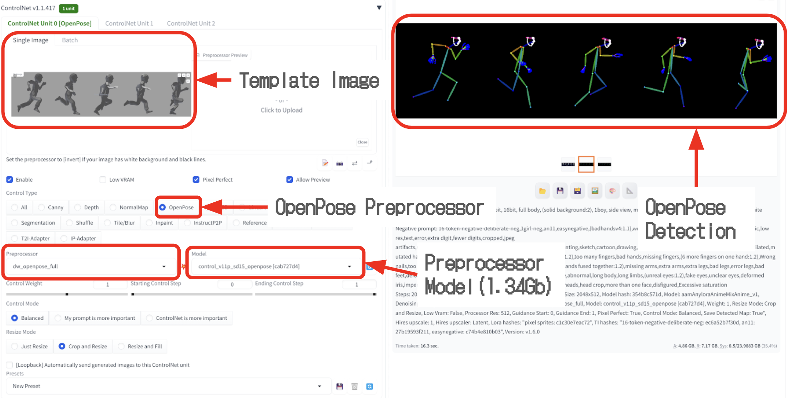

# Animyth: A tool for assisting creation of 2D animation for game development

## Overview
Animyth is an innovative approach to sprite sheet generation, leveraging advanced AI models to streamline the process of creating detailed, action-specific sprite sheets for game development. This project combines the power of GPT-4 for text processing and a stable diffusion model with ControlNet extension for sprite generation, offering a unique solution for game designers and animators.

## Features
- **Text-to-Sprite Sheet Conversion**: Transform simple text descriptions into detailed sprite sheets.
- **Custom Animation Templates**: Use custom dummy models in Mixamo for tailored animations.
- **Python Scripting**: Automated image processing for efficient sprite sheet creation.
- **Game Engine Compatibility**: Sprite sheets ready for integration into popular game engines like Unity.

## Getting Started
### Prerequisites
Before you begin, ensure you have met the following requirements:

- [ControlNet v1.1 nightly](https://github.com/lllyasviel/ControlNet-v1-1-nightly): For advanced model control and sprite sheet generation.
- [ControlNet v1.1 on Hugging Face](https://huggingface.co/lllyasviel/ControlNet-v1-1/tree/main): Access to the ControlNet model through Hugging Face's interface.
- [Pixel LoRA](https://civitai.com/images/3615104): LoRA for pixelizing the image
- [AAM Anylora Anime Mix Model](https://civitai.com/models/84586/aam-anylora-anime-mix-anime-screencap-style-model): A specific model used for anime-style sprite generation.
- [Stable Diffusion Web UI](https://github.com/AUTOMATIC1111/stable-diffusion-webui/tree/dev): Web interface for stable diffusion models.

Make sure to install and set up these resources as they are integral to the functioning of the Animyth project.

### Installation
#### Setup Text-to-Image block
- Clone [Stable Diffusion Web UI](https://github.com/AUTOMATIC1111/stable-diffusion-webui/tree/dev)
- Download [AAM Anylora Anime Mix Model](https://civitai.com/models/84586/aam-anylora-anime-mix-anime-screencap-style-model) and [Pixel LoRA](https://civitai.com/images/3615104)
- Follow instructions in Stable Diffusion Web UI repo to put the downloaded models in the right directory
- Follow [this](https://github.com/Mikubill/sd-webui-controlnet) to install ControlNet extention to the Stable Diffusion Web UI
- Download the OpenPose model from [ControlNet v1.1 on Hugging Face](https://huggingface.co/lllyasviel/ControlNet-v1-1/tree/main) and put into the right directory (follow instructions [here](https://github.com/Mikubill/sd-webui-controlnet))

#### Setup Text Processing Block GPT4 (To be improved)
- Clone this repo
- Modify text descriptions in GPT4-Prompt-Engineering sprite_sheet_input.csv and then open 'Tag Generator.ipynb'
- Change to your own GPT4 APIKey, and run
- The generated tags will be save in the 'out_sentences.csv'

## How Animyth Works
Explain how to use Animyth, including how to input descriptions and generate sprite sheets.

The input to Animyth will be a text description of a character following a specific format:
```
                    {A pixel-styled sprite sheet of a $Type $Description, $Action}
```

An example input would be 
```
A pixel-styled sprite sheet of a boy wearing white hoodie and black shorts, run
```

The input is processed by GPT4 API into a tag-like output
```
pixel,pixel art,pixelart,xiangsu,xiang su, full body,(solid background:2),1boy, side view, masterpiece,best,quality, white hoodie, black shorts, run
```

Then, this tag-like input will be passed into stable diffusion webui for text to image generation.

Meanwhile, the webui enables the ControlNet extension for character pose estimation from the selected prepared sprite sheet template for the corresponding action.

After a while, depending on the hardware on your machine, the sprite sheet will be generated mapping the text description as well as the pose estimated.

### Steps to Generate Sprite Sheets
- Start up Stable Diffusion WebUI
- Manually put the tags into the positive prompt text box inside the WebUI
- Put this into the negative prompt text box: ```16-token-negative-deliberate-neg,1girl-neg,an6,EasyNegativeV2,(badhandsv5-neg:1.1),(badhandsv4:1.1),worst quality,low quality,normal quality,ugly,mosaic,low res,text,error,extra digit,fewer digits,cropped,jpeg artifacts,signature,watermark,username,blur,CG,render,illustration,painting,sketch,cartoon,drawing,anime,monochrome,grayscale,tiling,morbid,mutilated,mutated hands,bad anatomy,bad proportions,extra limbs,(fused fingers:1.2),too many fingers,bad hands,missing fingers,(6 more fingers on one hand:1.2),Wrong nails,too long nails,bad nails,deformed hands,deformed fingers,(Two hands fused together:1.2),missing arms,extra arms,extra legs,bad legs,error legs,bad feet,deformity,malformed limbs,abnormal body,deformed,boring pose,abnormal,long body,long limbs,(unreal eyes:1.2),fake eyes,unclear eyes,deformed iris,imperfect eyes,glowing eyes,big chin,long neck,double head,extra heads,head crop,more than one face,disfigured,Excessive saturation```. This is the default negative tag prompt
- Manually select the appropriate sprite sheet template and upload it to the ControlNet extension under the WebUI. 
- Follow the setting shown in the figures below.




## Workflow Overview
1. **Text Processing**: Input text is converted to tag-like descriptions using GPT-4.
2. **Animation Preparation**: A custom dummy model is uploaded to Mixamo for animation creation.
3. **Sprite Sheet Generation**: The animations are processed into sprite sheets with the stable diffusion model.
4. **Post-Processing**: Additional Python scripts are used to refine the sprite sheets, like making backgrounds transparent.


## Example Outputs

A pixel-styled sprite sheet of a boy with white hoodie and jeans, run


A pixel-styled sprite sheet of a boy with white hoodie and jeans, idle


## Evaluation
Discuss both qualitative and quantitative evaluation methods used to assess the generated sprite sheets.

[Evaluation Rubric and Results](https://docs.google.com/spreadsheets/d/1fvtAMdXq1YJcjQeL_ZWMFmV4DXp12xBkmylsal35dFg/edit?usp=sharing)

### Overall Performance

- Character Consistency Across Frames	: 4.5
- Animation Smoothness	: 4.3
- Need for Manual Editing	: 3.9
- Matching Description : 4
- Overall : 4.2

## Prompt to GPT4
```
This is my input example
 'A pixel-styled sprite sheet of a boy wearing white hoodie and black shorts, run' 

 output should look like 
'pixel,pixel art,pixelart,xiangsu,xiang su, full body,(solid background:2),1boy, side view, masterpiece,best,quality, white hoodie, black shorts, run'

You may add your own tags to enhance the appearance of the character like the colour of hair or clothes.

Always include “pixel, pixel art, pixelart, xiangsu, xiang su, 8bit, 16bit, full body, (((solid background))), side view, masterpiece, best quality” in the output.

If it is a girl or a boy, you should say 1girl or 1boy
```

## Future Work
Outline potential improvements and future directions for Animyth.

- Make the pipeline autonomous
- Improve evaluation rubric for better system assessment
- Implement ways to generate variation of actions

## Authors
- **Sherry** - Input Dataset Creation and Prompt Engineering
- **Sky** - Sprite Sheet Template Preparation and Generation

## License
TBD

## Acknowledgments
Thanks CivitAI for providing the open-sourced stable diffusion models that make this project possible. Thanks to the authors of the models that this project used. 

---
